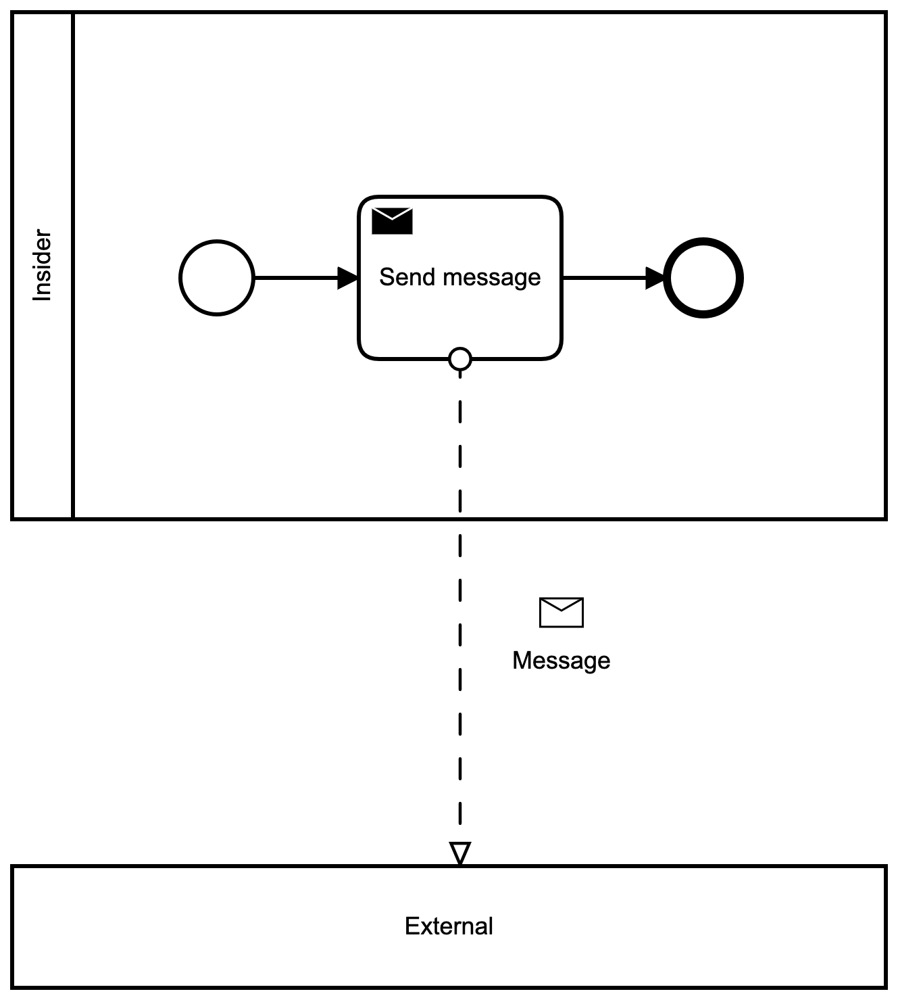

# Why the envelope will stay where it is

## update from the BPMN MIWG

---

## What's BPMN MIWG

Model Interchange Working Group

Vendors get together and make sure they follow the standard.

---

## What's bpmn-deco

DI extension for the envelope

```xml
<bpmndi:BPMNEdge id="Flow_09yxy22_di" bpmnElement="Flow_09yxy22">
  <extension>
    <deco:BPMNEnvelopeDecorator>
      <dc:Bounds height="12" width="17" x="350" y="300"/>
    </deco:BPMNEnvelopeDecorator>
  </extension>
  <di:waypoint x="350" y="250" />
  <di:waypoint x="350" y="500" />
</bpmndi:BPMNEdge>
```

---



---

## Problem

```sh
Error: invalid xml (status=WITH_ERRORS)
  [error] cvc-complex-type.2.4.c: The matching wildcard is strict, but no declaration can be found for element 'deco:BPMNEnvelopeDecorator'. (53:39)
```

---

## Explanation

Semantic (BPMN):

```xml
<xsd:element name="extensionElements" type="tExtensionElements" />
<xsd:complexType name="tExtensionElements">
  <xsd:sequence>
    <xsd:any namespace="##other" processContents="lax" minOccurs="0" maxOccurs="unbounded" />
  </xsd:sequence>
</xsd:complexType>
```

DI:

```xml
<xsd:element name="extension" minOccurs="0">
  <xsd:complexType>
    <xsd:sequence>
      <xsd:any namespace="##other" minOccurs="0" maxOccurs="unbounded" />
    </xsd:sequence>
  </xsd:complexType>
</xsd:element>
```

---

## Diff

```xml
<!-- Semantic (BPMN) -->
<xsd:any namespace="##other" processContents="lax" minOccurs="0" maxOccurs="unbounded" />
<!-- DI -->
<xsd:any namespace="##other" minOccurs="0" maxOccurs="unbounded" />
```

---

## ProcessContents

|type|explanation|
|-|-|
|`strict`|validate and throw if schema missing (DEFAULT)|
|`lax`|validate but skip if schema missing|
|`skip`|do not validate|

---

## Fix

```xml
<xsd:element name="extension" minOccurs="0">
  <xsd:complexType>
    <xsd:sequence>
      <xsd:any namespace="##other" processContents="lax" minOccurs="0" maxOccurs="unbounded" />
    </xsd:sequence>
  </xsd:complexType>
</xsd:element>
```

---

## Live demo

Let's check if the fix works.

---

## Implications

Until the spec is fixed, we cannot have proper DI extensions.

But it takes time to fix the spec (BPMN 2.0.2 was released in Dec 2013).

---

## Alternative solution within bpmn-deco

bpmn-deco could be re-implemented as a Semantic extension:

```xml
<bpmn:messageFlow id="Flow" sourceRef="Activity_1" targetRef="Participant_1" messageRef="Message">
  <bpmn:extensionElements>
    <deco:BPMNEnvelopeDecorator>
      <dc:Bounds height="12" width="17" x="350" y="300"/>
    </deco:BPMNEnvelopeDecorator>
  </bpmn:extensionElements>
</bpmn:messageFlow>
```

---

## Resources

* [BPMN MIWG](https://www.omgwiki.org/bpmn-miwg/doku.php)
* [bpmn-deco](https://github.com/bpmn-miwg/bpmn-deco)